# 江愷笙 <span style="color:black">(106062568)</span>

Here is the [github page](https://petersci.github.io/homework3-policy-gradient/) of my report.

# Homework3-Policy-Gradient report

TA: try to elaborate the algorithms that you implemented and any details worth mentioned.

## Overview

>Policy gradient methods are a type of reinforcement learning techniques that rely upon optimizing parametrized policies with respect to the expected return (long-term cumulative reward) by gradient descent. They do not suffer from many of the problems that have been marring traditional reinforcement learning approaches such as the lack of guarantees of a value function, the intractability problem resulting from uncertain state information and the complexity arising from continuous states & actions.
## Implementation

In this homework we have to use policy gradient method to solve the cartpole problem.
* Problem 1

In problem 1 we have to use tensorflow to construct DQN for the policy gradient. Here we have to add the softmax layer to obtain the probability distribution.

```python
fc = tf.layers.dense(self._observations, hidden_dim, tf.tanh)
probs = tf.layers.dense(fc, out_dim, tf.nn.softmax)
```

* Problem 2

In problem 2 we have to define our lost for the neural network, here the loss function is surrogate loss. However, we have to take care that for the optimizer in tensorflow, the task is to minimize the loss (gradient descent), but in policy gradient, we have to maximize the surrogate loss (gradient asscent). So here we take the negative number of the loss to minimize this negative number, which equals to maximize its positive number.

<table border=1>
<tr>
<td>
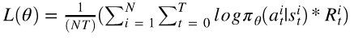
</td>
</tr>
</table>

```python
surr_loss = tf.reduce_mean(-log_prob * self._advantages)
```

the surrogate loss should take the average number over N episode and each time step, so we use tf.reduce_mean to obtain the average number.

* Problem 3

Here in problem 3 we use baseline to reduce the variance. So we replace the loss function by the formula shown below.

<table border=2>
<tr>
<td>
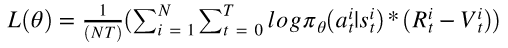
</td>
</tr>
<tr>
<td>
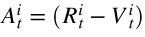
</td>
</tr>
</table>

```python
a = r - b
```

* Problem 4

In problem 4 we remove the baseline to see what is the difference between problem 3 and 4, I will discuss it in Results.

To remove the baseline, just replace 

```python
baseline = LinearFeatureBaseline(env.spec)
```

by

```python
baseline = None
```

* Problem 5

In problem 5 we have to implement a simple actor critic algorithm by replacing the first formula below in problem 3 with the second formula.

<table border=3>
<tr>
<td>

</td>
</tr>
<tr>
<td>
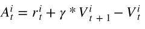
</td>
</tr>
</table>

We have to add the original reward to the discounted baseline at the next time step, so we have to left shift the baseline by 1.

```python
b[0] = 0.0			# let the first value to 0, after we shift left, it will be the last value
b_t_next = np.roll(b,-1)	# shift left by 1
y = x + discount_rate*b_t_next	# new R
return y
```

* Problem 6

Finally, we introduce generalized advantage estimation (GAE), which uses a hyperparameter lambda to comprimise two methods in problem 3 and 5.

<table border=4>
<tr>
<td>
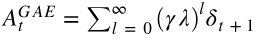
</td>
</tr>
<tr>
<td>
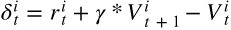
</td>
</tr>
</table>

```python
a = util.discount(a, self.discount_rate*LAMBDA)
```

## Installation
* Anaconda
* Ipython notebook
* Python3.5
* OpenAI gym
* Tensorflow
* to run the code, open Lab3-policy-gradient.ipynb by using Ipython notebook and execute each block.

## Results
* Problem 1~3

<table border=5>
<tr>
<td>
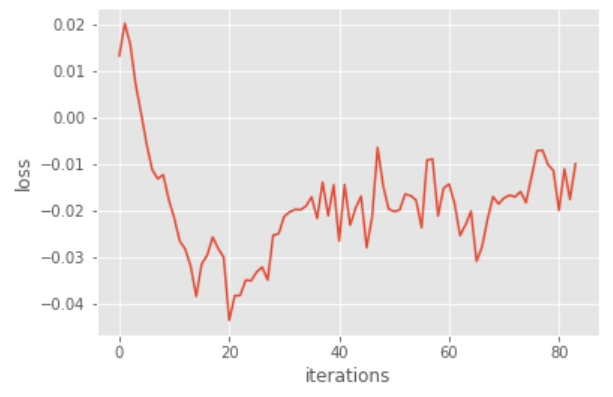
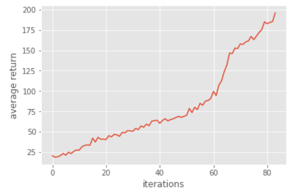
</td>
</tr>
</table>

* Problem 4

<table border=6>
<tr>
<td>
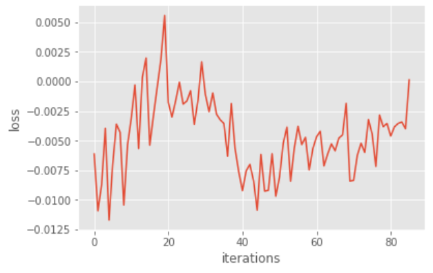
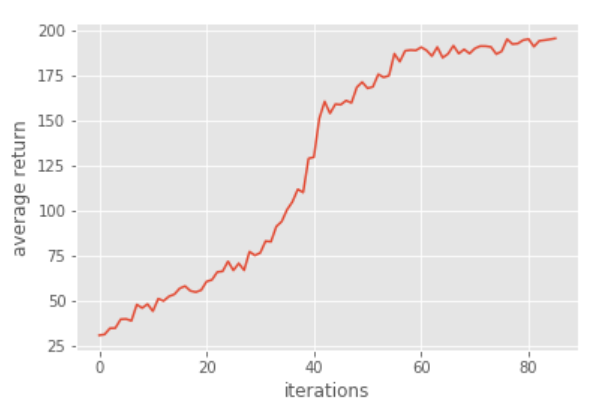
</td>
</tr>
</table>

Here we prove why baseline won't produce bias.

<tr>
<td>
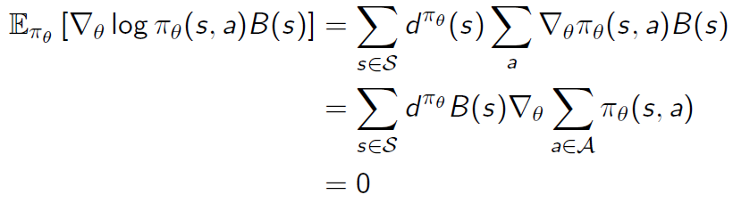
</td>
</tr>

We add baseline by subtracting the baseline function B(s). Since the operation is linear, we can only consider the term in the figure above which is related to B(s). Since that the baseline function B(s) only depend on s, we can take it outside the sigma which sum over all the actions. And the summation over all the policies is equal to 1, so the gradient on a constant is 0, thus the baseline won't introduce bias. 

By comparing problem 3 and 4, we can find that without baseline, the result will have bigger variance. Since we subtract the value function of the current state from the reward, we obtain the advantage which shows how much the current action is better than we usually do at this state. The baseline compensate the variance introduced from different states.

* Problem 5

<table border=7>
<tr>
<td>
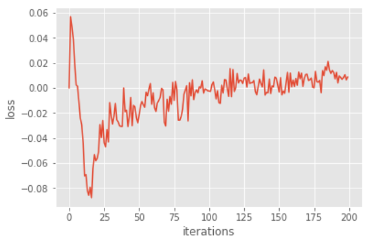
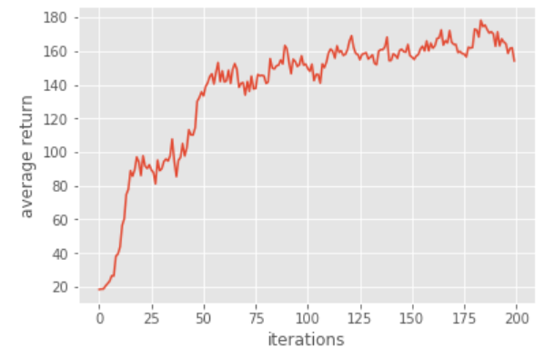
</td>
</tr>
</table>

* Problem 6

<table border=8>
<tr>
<td>
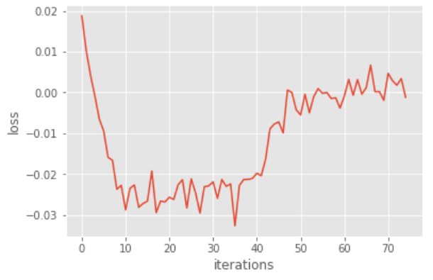
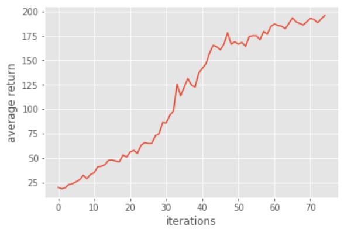
</td>
</tr>
</table>

In problem 6 we introduce a hyperparameter lambda, which value is between [0,1]. If lambda is 0, then this GAE algorithm will reduce to actor critic algorithm as we implemented in problem 5, who has lower variance but introduce bias. On the other hand, if lambda is 1, it will have higher variance, but it is more accurate on the value function (less bias). Thus lambda makes a compromise between bias and variance.


